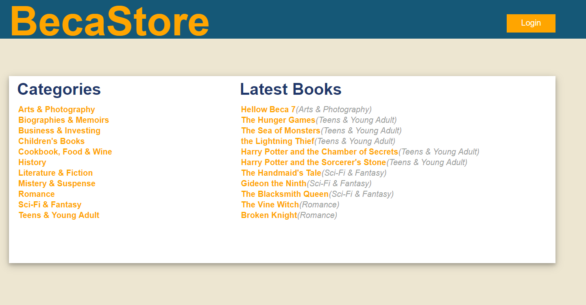

# CATALOG PROJECT - Udacity Full Stack Web Developer Nanodegree

> A Web Catalog with CRUD Features



For this project, my task was to create a web catalog that has CRUD tools. In addition, the catalog has a login system using Google's authentication
and authorization system.


###### _[PROJECT RUBRICS](project-rubrics.md)_
###### _[PROJECT DESCRIPTION](project-description.md)_

## Requirements

- Python 3.7.1
- psycopg2
- Postgresql 9.6
- Winzip or 7-zip

_You can use a virtual machine given in development setup session_

## Development setup

1. To have the same environment that this project was developed on, I recommend use a virtual machine.

2. Download and install [Vagrant](https://www.vagrantup.com/)

3. Download and install [VirtualBox](https://www.virtualbox.org/wiki/Download_Old_Builds_5_1)

4. At terminal in the folder with `vagrantfile` type, to bring the virtual machine online:
```sh
vagrant up
```

## Running the program

1. Download the database file [link](https://d17h27t6h515a5.cloudfront.net/topher/2016/August/57b5f748_newsdata/newsdata.zip)

2. Extract the newsdata.zip file. This file should be inside the program folder.

3. Login in the virtual machine at terminal:
```sh
vagrant ssh
```
4. Load the database using
```sh
psql -d news -f newsdata.sql
```
5. Connect to the database using
```sh
psql -d news
```
5. Create the **views given below**. Then exit
```sh
\q
```
6. Execute the Python file
```sh
python logs_analysis.py
```

_To exit the virtual machine just type `exit`_

## Created Views

```sql
CREATE VIEW info_authors AS
SELECT authors.name, articles.title, articles.slug
FROM authors
JOIN articles ON articles.author = authors.id
ORDER BY authors.name;
```
```sql
CREATE VIEW errors_per_day AS
SELECT date(time) AS day , count(path) AS errors
FROM log
WHERE status = '404 NOT FOUND'
GROUP BY day
ORDER BY day;
```
```sql
CREATE VIEW requests_day AS
SELECT date(time) AS day, count(*) AS requests
FROM log group by day
ORDER BY day;
```

## Usage example

When you run the program, the answers to the questions described in the description will be shown on the screen.

_If you find some bugs, problems you can send a message to me [twitter] or [email]._

## Release History

* 0.0.2
   * README file updated
* 0.0.1
   * First version

## Meta

Pedro Carvalho – [@PedrArch](https://twitter.com/PedroArch) – pedrofrancocarvalho@gmail.com

[https://github.com/PedroArch](https://github.com/PedroArch/)

## Contributing

1. Fork it (<https://github.com/PedroArch/log-analysis/fork>)
2. Create your feature branch (`git checkout -b feature/fooBar`)
3. Commit your changes (`git commit -am 'Add some fooBar'`)
4. Push to the branch (`git push origin feature/fooBar`)
5. Create a new Pull Request

<!-- Markdown link & img dfn's -->
[twitter]:https://twitter.com/PedroArch
[github]:https://github.com/PedroArch
[email]: pedrofrancocarvalho@gmail.com
